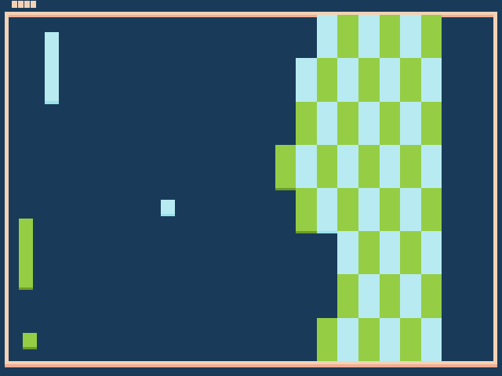

# Double Brickbreaker

Author: Brad Zhang

Design: A brickbreaker game, where there are double the balls, double the paddles, and double the trouble! Each pong can only hit the ball of the corresponding color, and each brick can only be broken by the ball of the corresponding color.

Screen Shot:

How To Play:

Use the W/S keys to control the green paddle, and the Up/Down arrow keys to control the blue paddle. The balls will pass through the paddle if the color doesn't match. Make sure to hit the balls back, or you'll be losing a bit of score!

Sources: 15-466 Pong starter code :)

This game was built with [NEST](NEST.md).
